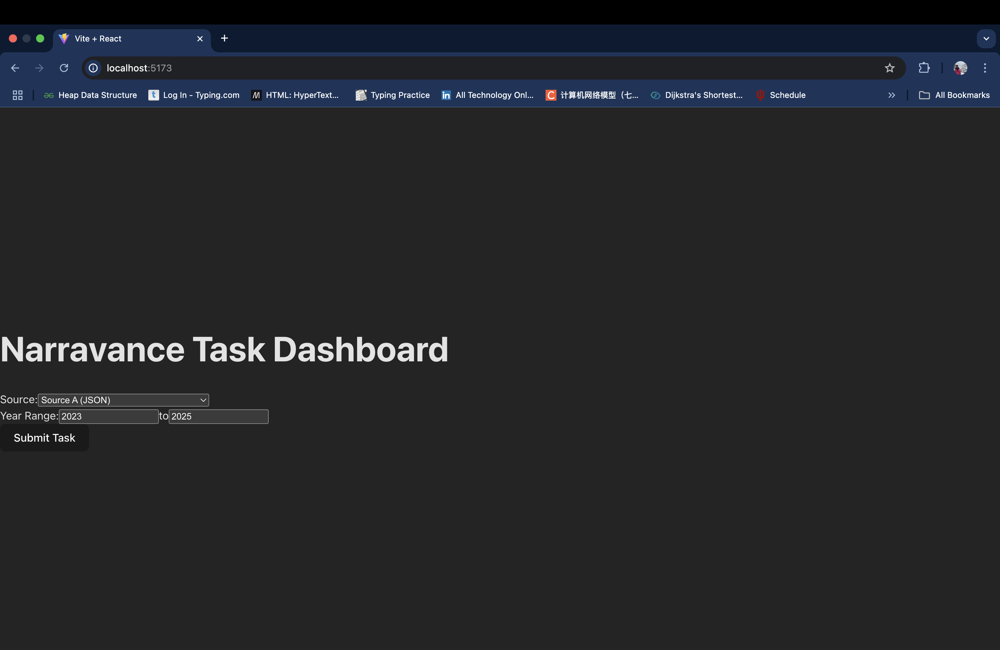
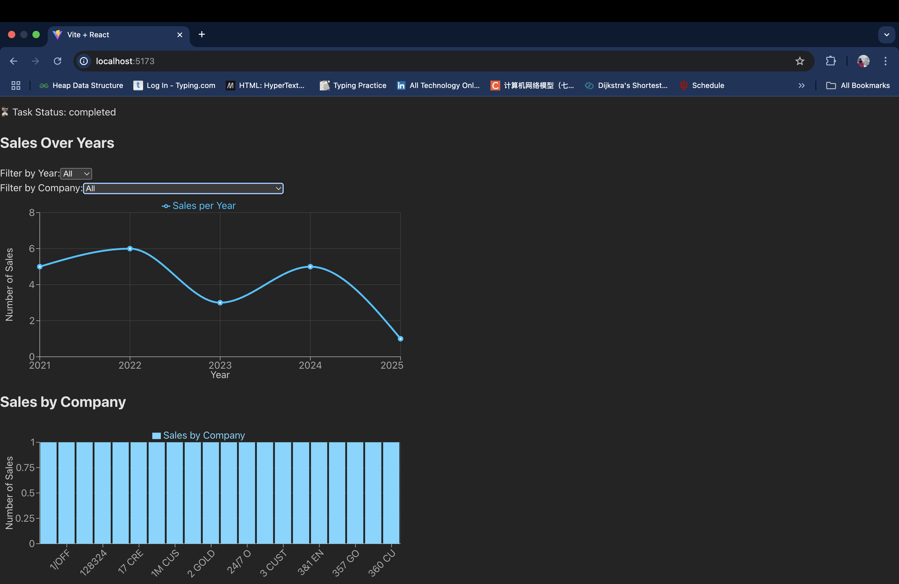

# 🚗 Car Sales Dashboard

## 📌 Overview

This is a full-stack data sourcing and visualization dashboard developed as part of a screening task. The app allows users to create data-fetching tasks from multiple sources (JSON, CSV, and an external car API), then visualize the retrieved sales data through interactive charts.

It simulates asynchronous task processing and provides rich analytics on car sales data over time and by company.

---

## ⚙️ Tech Stack

### Backend

- **FastAPI** — High-performance Python web framework
- **SQLAlchemy + SQLite** — ORM & lightweight relational database
- **Pydantic** — For data validation
- **Python multiprocessing & queue** — For job queue simulation

### Frontend

- **React + Vite** — Modern React stack
- **Tailwind CSS** — Utility-first styling
- **Recharts** — Charting library for dynamic visualizations
- **Axios** — For API calls

---

## ✨ Features

- Create data-fetching tasks from:
  - JSON file (source A)
  - CSV file (source B)
  - Live Car API (source C)
- Filter by date range and company (where applicable)
- Background job queue simulates `pending` → `in_progress` → `completed` task status
- Interactive analytics dashboard with:
  - 📈 Line chart for sales over years
  - 📊 Bar chart for sales by company
  - Filtering by year and company
- Clean UI with responsive design

---

## 📁 Folder Structure

```
car-sales-dashboard/
├── backend/               # FastAPI backend
│   ├── data/              # Data sources
│   │   ├── source_a.json
│   │   └── source_b.csv
│   ├── database.py        # Database setup
│   ├── job_queue.py       # Simulated job queue
│   ├── main.py            # FastAPI app entry point
│   ├── models.py          # SQLAlchemy models
│   ├── schemas.py         # Pydantic schemas
│   ├── tasks.py           # Task processing logic
│   └── requirements.txt   # Backend dependencies
├── frontend/              # React frontend
│   ├── public/            # Static files
│   ├── src/
│   │   ├── components/
│   │   │   ├── TaskForm.jsx
│   │   │   ├── TaskStatus.jsx
│   │   │   └── ChartDisplay.jsx
│   │   ├── App.jsx
│   │   ├── main.jsx
│   │   ├── App.css
│   │   └── index.css
│   ├── package.json
│   └── vite.config.js
├── .gitignore
├── README.md
└── app.db                 # SQLite DB (runtime generated)
```

---

## 🚀 How It Works

1. **Task Submission**  
   Users submit a task via the frontend, selecting the data source, year range, and optionally a company.

2. **Simulated Processing Delay**  
   Tasks start in a `pending` state and, after 5–10 seconds, move to `in_progress` before processing begins.

3. **Data Filtering & Storage**  
   Filtered data based on year and company is saved to a local SQLite database, linked to the task ID.

4. **Automatic Status Updates**  
   The frontend polls the backend every 2 seconds to update task status. Once `completed`, the processed data is fetched.

5. **Interactive Dashboard**  
   Visualizations include:
   - Line chart for total sales per year
   - Bar chart for sales by company
   - Filters for year and company

---

## 🎥 Demo

👉 [Watch Demo on YouTube](https://youtu.be/VsNJ_DNyxPw)

---

## ⚙️ Setup & Installation

### 1. Clone the Repository

```bash
git clone https://github.com/Ajithwk/car-sales-dashboard.git
cd car-sales-dashboard
```

### 2. Set Up and Run the Backend

```bash
cd backend
python3 -m venv venv
source venv/bin/activate
pip install -r requirements.txt
uvicorn main:app --reload
```

Backend running at: [http://127.0.0.1:8000](http://127.0.0.1:8000)

### 3. Set Up and Run the Frontend

In a new terminal:

```bash
cd frontend
npm install
npm run dev
```

Frontend running at: [http://localhost:5173](http://localhost:5173)

---

## 📡 API Endpoints

All endpoints are served from [http://127.0.0.1:8000](http://127.0.0.1:8000)

### 📤 POST `/tasks` – Create a Task

**Request Body:**

```json
{
  "source": "A", // "A" | "B" | "C"
  "start_year": 2023,
  "end_year": 2025,
  "filter_company": "Honda" // Optional, only for source B
}
```

**Response:**

```json
{
  "task_id": 1,
  "status": "pending"
}
```

---

### 🔍 GET `/tasks/{task_id}` – Get Task Status

**Response:**

```json
{
  "task_id": 1,
  "status": "completed"
}
```

---

### 📊 GET `/tasks/{task_id}/data` – Get Processed Data

**Response:**

```json
[
  {
    "company": "Honda",
    "model": "Civic",
    "year": 2023,
    "price": 22000,
    "date_of_sale": "2023-05-01"
  }
]
```

---

### 🛠️ GET `/debug/sales` – View All Sales (Debugging)

**Response:**

```json
[
  {
    "company": "Honda",
    "model": "Civic",
    "year": 2023,
    "price": 22000,
    "date_of_sale": "2023-05-01"
  },
]
```

## 📸 Screenshots

### 📊 Dashboard View

This section of the app displays dynamic, interactive charts for sales data:

- A **line chart** showing total sales over the years
- A **bar chart** comparing sales across different companies
- Filtering options by **year** and **company**
- Responsive layout for clean viewing on any screen size

🖼️  


---

### 📝 Task Submission Form

Users can submit a new task by:

- Choosing one of the three data sources (JSON, CSV, or Live Car API)
- Selecting a start and end year
- Optionally filtering by company (for CSV or API sources)
- Submitting the task to trigger processing in the backend queue

🖼️  

